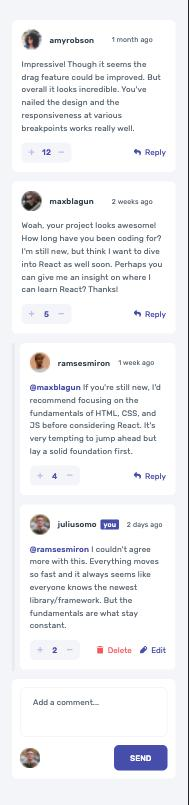
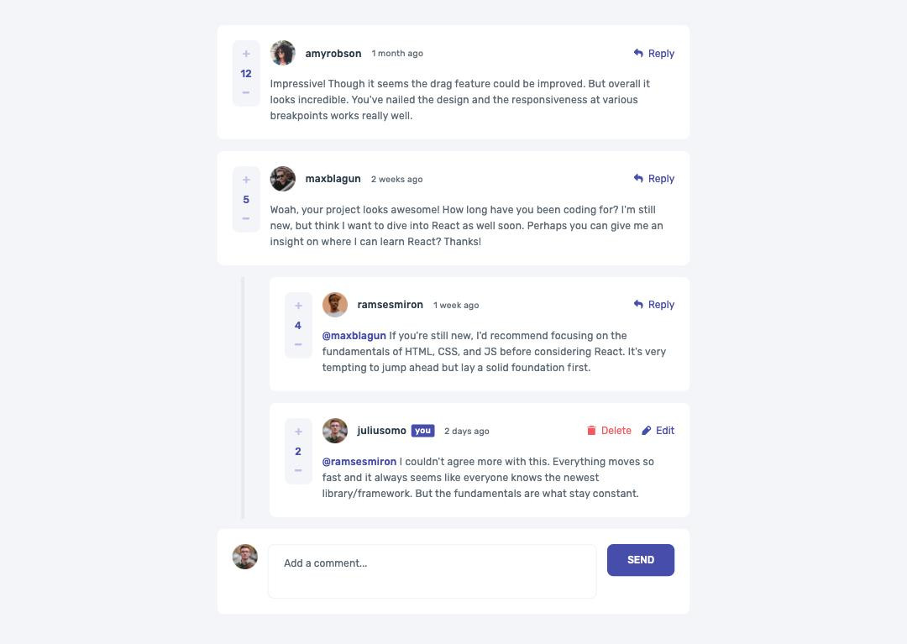

# Interactive comments section

This is a solution to the [Interactive comments section challenge on Frontend Mentor](https://www.frontendmentor.io/challenges/interactive-comments-section-iG1RugEG9). Frontend Mentor challenges help you improve your coding skills by building realistic projects. 

## Table of contents

- [Overview](#overview)
  - [The challenge](#the-challenge)
  - [Screenshot](#screenshot)
  - [Links](#links)
- [My process](#my-process)
  - [Built with](#built-with)
- [Author](#author)

## Overview

### The challenge

Users should be able to:

- View the optimal layout for the app depending on their device's screen size
- See hover states for all interactive elements on the page
- Create, Read, Update, and Delete comments and replies
- Upvote and downvote comments

### Screenshot

### Links

- Solution URL: [Add solution URL here](https://your-solution-url.com)
- Live Site URL: [Add live site URL here](https://your-live-site-url.com)

## My process

### Built with

- [Next.js](https://nextjs.org/) - React framework
  - static generation with data
- [React](https://reactjs.org/) - JS library
  - functional components
  - hooks: useState, useEffect, useRef
- HTML5
  - semantic markup
- CSS
  - custom properties
  - Flexbox
  - CSS Grid
- Git version control
- Chrome DevTools
- Mobile-first workflow
- VS Code

## Author

- Twitter - [@adriansseur](https://www.twitter.com/adriansseur)
- YouTube - [Adriansseur](https://www.youtube.com/channel/UCjBO_Yz33-oZygrgQmqECIg)
- Frontend Mentor - [@adriansseur](https://www.frontendmentor.io/profile/adriansseur)